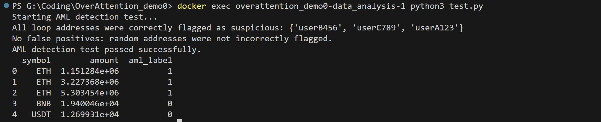

### 🧪 Testing Strategy

This project uses **Jest** and **React Testing Library** for unit and component testing.

#### ✅ What is tested


* `Data_acquisition` component

  * Test Module Description:

    This module verifies the connectivity and response correctness of all external data source APIs, including CoinGecko, CoinMarketCap, Bitquery, and various news sources. It ensures that the data returned by these APIs can be parsed and (in real environments) inserted into the database correctly.

    ```bash
    # Step 1: Start the container using docker-compose with build
    docker compose up --build

    # Step 2: In another terminal, run the data acquisition test script
    docker exec data_acquisition python3 test.py
    ```

    The output should show successful execution logs for each API module tested. Failures will be printed with detailed error messages for debugging.

    Example output (truncated):

    ```
    ✅ Testing CoinMarketCap...
    DB execute called with: ('INSERT INTO ...', [...])

    ✅ Testing CoinGecko...
    DB execute called with: ('INSERT INTO ...', [...])

    ✅ Testing Bitquery...
    Testing symbol: BTC
    DB execute called with: ...
    ```
 

* `Data_analysis` component

  * Test Module Description:

    This module is used to test the functionality of the `Data_analysis` component. Follow the steps below to run the tests:

    ```bash
    # Step 1: Start the container using docker-compose with build
    docker compose up --build

    # Step 2: In another terminal, run the test script inside the container
    docker exec data_analysis python3 test.py
    ```
    The result of the test being successful should be as follows.

    


* `Data_gateway` component

  * Test Module Description:
  
    This project includes a set of manual API Gateway tests for the `data_gateway` service. These tests are **not** executed in the GitHub Actions CI pipeline. To run them locally:

    ```bash
    # Step 1: Start the DataGateway service

    cd data_gateway
    python app.py
    ```
      
     Or, if you use Docker Compose:
     ```bash
     docker-compose up -d data_gateway
     ```
     ```bash
     # Step 2: Run the API Gateway tests.In a separate terminal at the project root:  
     python -m pytest api_tests/
     ```
     The result of the test being successful should be as follows:
     
     7 passed in 1.12s
* `Header` component

  * Displays site title and primary navigation links (`Dashboard`, `Pricing`)
  * Conditionally renders `Sign In` / `Register` buttons when not logged in
  * Shows `account` menu with `View Profile` and `Log Out` options when logged in
  * Simulates sessionStorage clearing and navigation on logout (`handleLogout` tested via interaction)

* `Footer` component

  * Renders copyright text with dynamic current year
  * Displays footer links: `Contact Us` and `Privacy Policy`
  * Uses Chakra UI layout for responsive alignment across screen sizes

* `AmlAlertBox` component

  * Shows **"AML Warning"** when there is at least one item with `aml !== "Safe"`
  * Displays a list of suspicious activity titles and source links when risky data is present
  * Shows **"AML Status"** and safe message when no suspicious activity exists
  * Applies correct background and border colors conditionally (`yellow.50` / `green.50`) based on AML risk presence

### 📄 Pages

#### `Login` page

* Renders email and password input fields.
* Displays login button and register link.
* Shows Chakra `toast` warning when attempting login with empty fields (mocked `useToast`).
* Uses React Router’s `useNavigate` for redirect after login.
* Tested with ChakraProvider and BrowserRouter wrappers.

#### `Pricing` page

* Renders three subscription plans: Free, Pro, and Pro Max.
* "Free" plan button is disabled and labeled “Subscribed”.
* "Pro" and "Pro Max" plans have “Upgrade” buttons and are interactive.
* Monthly and Yearly toggle buttons switch visual state (variant).
* Hover interaction tested implicitly by rendering motion-wrapped cards.

#### `Register` page

  * Renders all form inputs with accessible placeholders for `username`, `email`, `password`, and `confirm password`
  * Displays error message `"Passwords do not match."` when confirmation fails
  * Submits form correctly when all fields are valid
  * Sends correct payload to backend API (`/api/auth/register`) and stores temporary user in localStorage
  * Uses Chakra UI and React Router integration properly (`RouterLink`, `useToast`, `useNavigate`)

#### `Survey` page

  * Loads current registered user from `localStorage` (tempUser)
  * Renders 6 onboarding survey questions using Chakra `FormControl` and `Select`
  * Handles selection and updates internal state correctly via `handleAnswer`
  * Validates that all 6 questions are answered before allowing submission
  * Submits answers to `/api/survey/initial_submit` with correct payload format
  * On success: clears `tempUser` from localStorage and navigates to login page with toast
  * On error: displays `toast` messages and keeps user on the same page
  * Displays fallback error alert if no tempUser is found in localStorage

#### `UserProfile` page

  * Renders user profile data correctly, including username, email, subscription plan, and rating
  * Displays followed currencies as tags
  * Shows loading spinner before data loads
  * Displays error alert if no token or fetch fails
  * Opens modal to edit preferences when clicking "Edit"
  * Limits selection based on user subscription level (`Free`, `Pro`, `Enterprise`)
  * Posts updated preferences correctly with success toast feedback


 📦 Installed Testing Dependencies

We installed the following packages to support testing:

```bash
npm install --save-dev @testing-library/react @testing-library/jest-dom @testing-library/user-event
```

These libraries help simulate user interaction and provide more expressive matchers (like `.toBeInTheDocument()`).

#### 🧪 How to run tests

To run the tests locally:

```bash
npm test
```

This will watch for file changes and re-run relevant test suites.

#### 🛠 Mocking & Router Context

We mock any `useNavigate` or routing hooks using `<BrowserRouter>` or `<MemoryRouter>` wrappers during render. This avoids errors like `useNavigate() may be used only in the context of a <Router>`.

We also avoid testing Chakra UI internals by assuming the external UI library works as intended.

#### 🚧 Future Testing Plans

We plan to add more test coverage for:

* `KeyIndicators` component
* `LatestNews` and `AmlAlertBox` components
* Error boundary behavior


### ✅ Automated Testing with GitHub Actions

This project uses **GitHub Actions** to automatically run frontend tests on each commit or pull request.

#### Workflow File

We have defined a workflow in:

```
.github/workflows/test.yml
```

It runs `npm install` and `npm test` using the official `node` image.

#### How It Works

* When a commit is pushed or a pull request is opened/merged into `main` (or any branch), the workflow is triggered.
* It installs all dependencies and runs all test suites.
* If all tests pass ✅, the commit is marked as successful.
* If any test fails ❌, the workflow fails and is highlighted on the GitHub Actions tab.

#### Viewing Test Runs

You can view the test results by navigating to the **Actions** tab in the repository:

> GitHub ➝ Actions ➝ “Run React Tests”

Example output:

* ✅ All tests passed: `Test Suites: 2 passed, 2 total`
* ❌ Test failure will be shown in red, with detailed logs.

#### Installing New Dependencies for Testing

If additional packages are installed for testing (e.g. `@testing-library/react`, `jest`), make sure to run:

```bash
npm install --save-dev <package-name>
```

and commit the updated `package.json` and `package-lock.json` so CI can run successfully.


## ✅ ESLint Setup

We use ESLint with the Airbnb style guide, with some relaxed rules for testing and developer flexibility.

- Linting is set up with a `.eslintrc.json` configuration
- Commands:
  ```bash
  npm run lint      # Check all issues
  npm run lint:fix  # Auto-fix formatting issues

  

